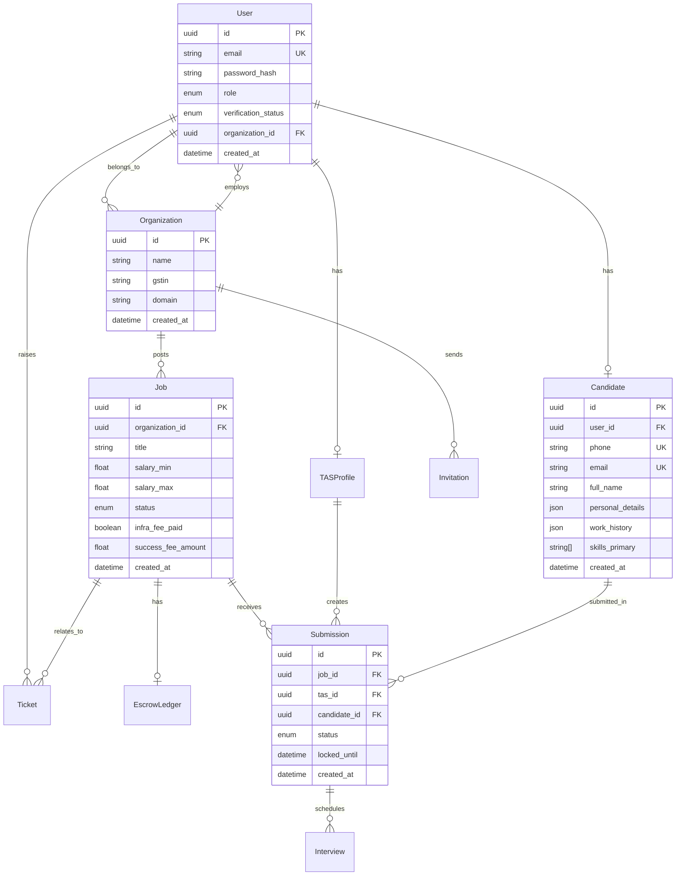

# Database Schema

## Overview

The Recruitkart database schema is designed to support a multi-role recruitment platform with transparent fee structures and escrow-based payments.

## Schema Organization

The schema is split into domain-specific files for better maintainability:

- **base.prisma** - Configuration and datasource
- **enums.prisma** - All enum definitions
- **users.prisma** - User and organization models
- **jobs.prisma** - Job and escrow models
- **candidates.prisma** - Candidate profiles
- **submissions.prisma** - Submission and interview tracking
- **support.prisma** - Support ticketing

## Entity Relationship Diagram



## Core Models

### User
Central authentication and authorization model.

**Fields:**
- `id` (UUID, PK) - Unique identifier
- `email` (String, Unique) - Login email
- `password_hash` (String) - bcrypt hashed password
- `role` (UserRole) - User's role in the system
- `verification_status` (VerificationStatus) - Account verification state
- `organization_id` (UUID, FK, Optional) - Associated organization
- `reset_token` (String, Optional) - Password reset token
- `reset_token_expiry` (DateTime, Optional) - Token expiration
- `created_at` (DateTime) - Account creation timestamp
- `updated_at` (DateTime) - Last update timestamp

**Relations:**
- `organization` - Many-to-one with Organization
- `tas_profile` - One-to-one with TASProfile
- `candidate` - One-to-one with Candidate
- `tickets` - One-to-many with Ticket

**Indexes:**
- Unique index on `email`

---

### Organization
Represents companies using the platform.

**Fields:**
- `id` (UUID, PK) - Unique identifier
- `name` (String) - Company name
- `gstin` (String, Optional) - GST identification number
- `domain` (String, Optional) - Company domain
- `website` (String, Optional) - Company website
- `logo_url` (String, Optional) - Company logo URL
- `created_at` (DateTime) - Registration timestamp
- `updated_at` (DateTime) - Last update timestamp

**Relations:**
- `users` - One-to-many with User
- `jobs` - One-to-many with Job
- `invitations` - One-to-many with Invitation

---

### Job
Job postings created by companies.

**Fields:**
- `id` (UUID, PK) - Unique identifier
- `organization_id` (UUID, FK) - Posting company
- `title` (String) - Job title
- `description` (String, Optional) - Job description
- `salary_min` (Float, Optional) - Minimum salary
- `salary_max` (Float, Optional) - Maximum salary
- `status` (JobStatus) - Current job status
- `infra_fee_paid` (Boolean) - Infrastructure fee payment status
- `success_fee_amount` (Float) - Success fee amount
- `created_at` (DateTime) - Creation timestamp
- `updated_at` (DateTime) - Last update timestamp

**Relations:**
- `organization` - Many-to-one with Organization
- `escrow_ledger` - One-to-one with EscrowLedger
- `submissions` - One-to-many with Submission
- `tickets` - One-to-many with Ticket

---

### Candidate
Candidate profiles with structured data.

**Fields:**
- `id` (UUID, PK) - Unique identifier
- `user_id` (UUID, FK, Optional) - Linked user account
- `phone` (String, Unique) - Contact phone
- `email` (String, Unique) - Contact email
- `full_name` (String) - Candidate name
- `identity_hash` (String, Optional) - Deduplication hash
- `personal_details` (JSON, Optional) - Location, notice period, CTC
- `work_history` (JSON, Optional) - Employment history
- `education_history` (JSON, Optional) - Educational background
- `social_links` (JSON, Optional) - LinkedIn, GitHub, etc.
- `skills_primary` (String[]) - Top 5 skills (indexed)
- `skills_secondary` (String[]) - Additional skills
- `created_at` (DateTime) - Profile creation timestamp
- `updated_at` (DateTime) - Last update timestamp

**Relations:**
- `user` - One-to-one with User
- `submissions` - One-to-many with Submission

**Indexes:**
- Unique index on `phone`
- Unique index on `email`
- Index on `skills_primary` for fast skill search

---

### Submission
Candidate submissions to jobs by TAS.

**Fields:**
- `id` (UUID, PK) - Unique identifier
- `job_id` (UUID, FK) - Target job
- `tas_id` (UUID, FK) - Submitting TAS
- `candidate_id` (UUID, FK) - Submitted candidate
- `status` (SubmissionStatus) - Current status
- `locked_until` (DateTime, Optional) - Lock expiration
- `created_at` (DateTime) - Submission timestamp
- `updated_at` (DateTime) - Last update timestamp

**Relations:**
- `job` - Many-to-one with Job
- `tas` - Many-to-one with TASProfile
- `candidate` - Many-to-one with Candidate
- `interviews` - One-to-many with Interview

**Constraints:**
- Unique constraint on `[job_id, candidate_id]` (one submission per candidate per job)

---

### Interview
Interview scheduling and feedback.

**Fields:**
- `id` (UUID, PK) - Unique identifier
- `submission_id` (UUID, FK) - Related submission
- `round_number` (Int) - Interview round (1, 2, 3...)
- `round_type` (String) - Type (Technical, HR, Coding)
- `status` (InterviewStatus) - Current status
- `outcome` (InterviewOutcome) - Interview result
- `feedback_json` (JSON, Optional) - Structured feedback
- `zoom_meeting_id` (String, Optional) - Meeting ID
- `recording_url` (String, Optional) - Recording URL
- `scheduled_at` (DateTime, Optional) - Scheduled time
- `created_at` (DateTime) - Creation timestamp
- `updated_at` (DateTime) - Last update timestamp

**Relations:**
- `submission` - Many-to-one with Submission

---

### EscrowLedger
Financial escrow tracking for jobs.

**Fields:**
- `id` (UUID, PK) - Unique identifier
- `job_id` (UUID, FK, Unique) - Associated job
- `amount` (Float) - Escrowed amount
- `status` (EscrowStatus) - Current status
- `deposited_at` (DateTime) - Deposit timestamp
- `release_date` (DateTime, Optional) - Release/refund date
- `created_at` (DateTime) - Creation timestamp
- `updated_at` (DateTime) - Last update timestamp

**Relations:**
- `job` - One-to-one with Job

---

## Enums

### UserRole
```prisma
enum UserRole {
  ADMIN
  SUPPORT
  OPERATOR
  TAS
  CANDIDATE
  COMPANY_ADMIN
  COMPANY_MEMBER
  INTERVIEWER
  DECISION_MAKER
}
```

### JobStatus
```prisma
enum JobStatus {
  DRAFT
  OPEN
  PRIVATE
  CLOSED
  FILLED
}
```

### SubmissionStatus
```prisma
enum SubmissionStatus {
  PENDING_CONSENT
  LOCKED
  ACTIVE
  REJECTED_BY_CANDIDATE
  EXPIRED
  INTERVIEWING
  HIRED
}
```

### EscrowStatus
```prisma
enum EscrowStatus {
  HELD
  RELEASED_TO_TAS
  REFUNDED_TO_COMPANY
  DISPUTED
}
```

## Migrations

Migrations are managed by Prisma and stored in `prisma/migrations/`.

**Run migrations:**
```bash
npx prisma migrate dev --name <migration_name>
```

**Deploy to production:**
```bash
npx prisma migrate deploy
```

## Seeding

The database is seeded with test data for all roles:

```bash
npm run db:seed
```

**Seeded users:**
- Admin, Support, Operator
- Company Admin, Member, Interviewer, Decision Maker
- TAS, Candidate
- Sample Job and Submission

## Indexing Strategy

- **Primary Keys**: UUID for all tables
- **Unique Constraints**: Email, phone, tokens
- **Foreign Keys**: All relations indexed
- **Custom Indexes**: `skills_primary` for fast search

## Data Integrity

- **Cascading Deletes**: Configured for related data
- **Unique Constraints**: Prevent duplicates
- **Foreign Keys**: Maintain referential integrity
- **Check Constraints**: Validate data ranges
